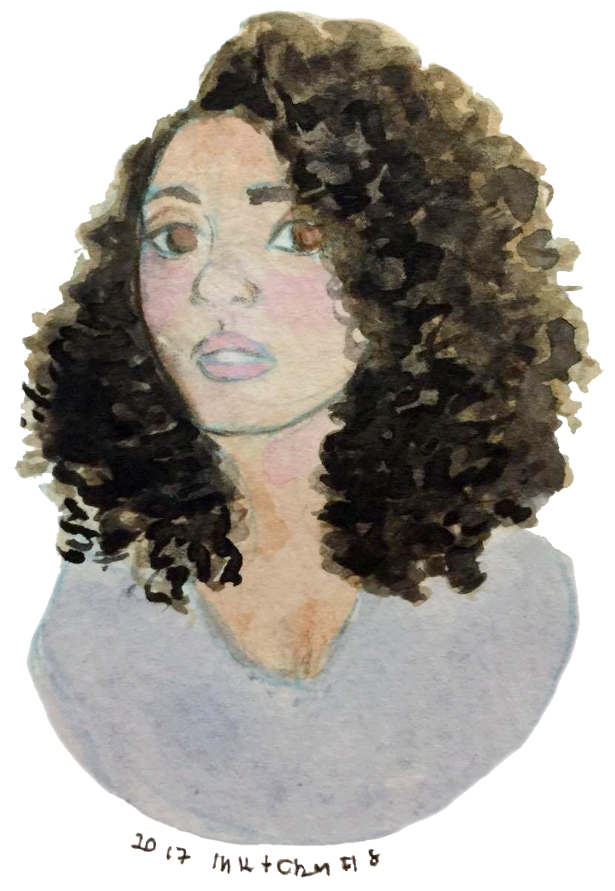

 
     
    

        <i>M.Sc. in Information Science | Software Engineer</i>
    

    
  

  

## Professional Indexing

### **[C] Cloud and Infrastructure**
- **Scope Note:** Orchestration of distributed services and automation of deployment pipelines in high-availability environments.
- **Trajectory:**
    - *Public Cloud:* Proficiency in AWS (Lambda, S3, API Gateway, IAM) and GCP (Google Cloud Platform).
    - *DevOps Cycle:* Creation of CI/CD pipelines via Jenkins and version control with Git and Mercurial.

### **[I] Information Science**

- **Scope Note:** Interdisciplinary field focused on the collection, classification, manipulation, storage, and retrieval of information.
- **Trajectory:**
    - *Social Memory:* Academic research focused on the construction of memory spaces in Brazilian Hip Hop (UFMG).
    - *Knowledge Management:* Application of Information Science principles in software architecture to transform data into retrievable knowledge.

### **[S] Software Engineering**
- **Scope Note:** Application of systematic methods to software development, focusing on design patterns, data integrity, and system scalability.
-  **Trajectory:**
    - *Java Ecosystem:* Development of RESTful APIs and microservices using Java 17+ and Spring Boot.
    - *C# & .NET Core:* Experience focused on complex business rules, security layers, and fraud prevention.
    - *Systems Programming:* Maintenance of internal libraries and search services in C++11.

## Academic Trajectory

| Institution | School/Unit | Academic Domain                                               | Period      |
| ----------- | ----------- | ------------------------------------------------------------- | ----------- |
| **UTFPR**   | COPPG       | Specialization in Java Technology                             | 2023 – 2025 |
| **UFMG**    | PPGCI/ECI   | Master's in Information Science                               | 2020 – 2024 |
| **UFRJ**    | FACC/CBG    | Bachelor's in Library Science and Information Unit Management | 2015 – 2019 |

## Community

### [G]
#### Google Developers Group
- **GDG São Paulo**: Host at the event **["Do Hard ao Soft - In Black Consciousness Month, we celebrate tech talent"](https://www.youtube.com/watch?v=bBcRwRF8n-A)** (Nov/2024).
- **GDG Nova Lima**:
  - Volunteer Organizer (Jul/2024 – Sep/2024).
  - Speaker on the theme *"Tech Career Challenges (And How to Overcome Them)"* (Aug/2023).
#### Google
- **Round Table participant** at the internal event **[Mind The Gap](https://sites.google.com/site/mindthegapprogram/home)** (Aug/2023).

### [W]
#### Women in Tech (WiT)
- **Speaker**: Guest at the event **["Black Women in Technology"](https://www.youtube.com/watch?v=lWvDkMnfR3I)** with the theme *"Efficiency Beyond Code: How to choose the stack strategically"* (Nov/2024).
#### Women's Programming Marathon (MFP)
- **C++ Instructor**: Taught the C++ language course to competitors (Apr/2024).
- **Communication Advisor**: Volunteer work in the marathon's strategic communication team (Mar/2024 – Jun/2024).

 
  <i>"Reading generates Information, Information generates Knowledge, Knowledge is a capital that never devalues."</i>

